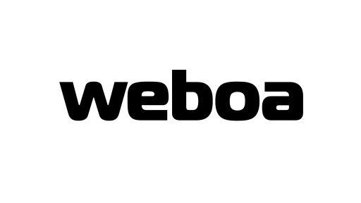

[![Visitors][visitors-shield]][no]
[![Contributors][contributors-shield]][contributors-url]
[![Watchers][watchers-shield]][no]
[![Forks][forks-shield]][forks-url]
[![Stargazers][stars-shield]][stars-url]

<!-- PROJECT LOGO -->
<br />
<p align="center">
  <a href="https://pypi.org/project/weboa/">
    
  </a>

  <p align="center">
    A project/package manager with style preprocessing
  </p>
</p>
<details open="open">
  <summary>Table of Contents</summary>
  <ol>
    <li>
      <a href="#about-the-project">About The Project</a>
    </li>
    <li>
      <a href="#getting-started">Getting Started</a>
      <ul>
        <li><a href="#prerequisites">Prerequisites</a></li>
        <li><a href="#installation">Installation</a></li>
      </ul>
    </li>
    <li><a href="#usage">Usage</a></li>
    <li><a href="#license">License</a></li>
    <li><a href="#contact">Contact</a></li>
  </ol>
</details>


<!-- ABOUT THE PROJECT -->
## About The Project

[![Product Name Screen Shot][product-screenshot]](https://pypi.org/project/weboa/)

Weboa is a project and local NVG package manager. It allows you to create templates for projects.  
**Currently, there is available only PHP web projects**.   

You can:  
1. Create a project  
2. Select a preprocessor (less/sass/scss)  
3. Add css frameworks  
4. Add JS frameworks and libraries  
5. Add PHP libraries  
6. Add fonts to your project  
7. Minify your js and css files  


<!-- GETTING STARTED -->
## Getting Started

For Weboa usage you need install python and pip. Then, install weboa through pip.

### Prerequisites

An example for Ubuntu,Debian  
* apt
  ```sh
  apt install python3 python3-pip
  ```

### Installation

1. Install Weboa (pip)
   ```sh
   pip install weboa
   ```
2. Install Weboa (pip3)
   ```sh
   pip3 install weboa
   ```


<!-- USAGE EXAMPLES -->
## Usage

Usage: weboa [-h] [--init OUTPUT_DIR] [--start] [--langs en...]  
  
Project/Package manager.  
  
positional arguments:  
  --css                 Select preprocess (less|sass|scss)  
  -L, --langs           Select languages shortly (ru|en|ro)  
  
optional arguments:  
  -h, --help            Show this help text
  -a, --add             Css [framework], js [framework], php [framework], fonts [font]  
  --list                Select list of all frames for [--add]  
  -r, --repo            Select list of all PHP packaged  

  -l, --less            Start LESS watcher. Use with & in the end  
  -s, --sass            Start SASS watcher. Use with & in the end  
  -s, --scss            Start SCSS watcher. Use with & in the end  

  -v, --version         Show current version of Weboa  
  -u, --update          Update Weboa through pip  

  -b, --build           Minify .js, .css files  
  -S, --start           Init .weboa project file  
  -i, --init            Initi project (use --init with OUTPUT_DIR)  


<!-- LICENSE -->
## License

Distributed under the Apache2 License. See `LICENSE` for more information.


<!-- CONTACT -->
## Contact

Alexandr Vopilov - [Facebook](https://www.facebook.com/lonagi22/) - lonagi@nvg-group.com

Project Link: [https://pypi.org/project/weboa/](https://pypi.org/project/weboa/)


[no]: http://github.com/lonagi/weboa
[visitors-shield]: https://shields-io-visitor-counter.herokuapp.com/badge?page=lonagi.weboa&label=Visitors&labelColor=000000&logo=GitHub&logoColor=FFFFFF&color=1D70B8&style=for-the-badge
[watchers-shield]: https://img.shields.io/github/watchers/lonagi/weboa?style=for-the-badge
[contributors-shield]: https://img.shields.io/github/contributors/lonagi/weboa?style=for-the-badge
[contributors-url]: https://github.com/lonagi/weboa/graphs/contributors
[forks-shield]: https://img.shields.io/github/forks/lonagi/weboa?style=for-the-badge
[forks-url]: https://github.com/lonagi/weboa/network/members
[stars-shield]: https://img.shields.io/github/stars/lonagi/weboa?style=for-the-badge
[stars-url]: https://github.com/lonagi/weboa/stargazers
[license-url]: https://github.com/lonagi/weboa/blob/main/LICENSE
[product-screenshot]: misc/carbon.png