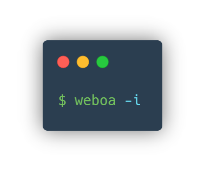

|Visitors| |Contributors| |Watchers| |Forks| |Stargazers|

.. raw:: html

   <!-- PROJECT LOGO -->

.. raw:: html

   

     

.. raw:: html

   

       

A project/package manager with style preprocessing

.. raw:: html

   

   

 Table of Contents

.. raw:: html

   <ol>
       <li>
         

About The Project

.. raw:: html

   </li>
       <li>
         

Getting Started

.. raw:: html

   <ul>
           <li>

Prerequisites

.. raw:: html

   </li>
           <li>

Installation

.. raw:: html

   </li>
         </ul>
       </li>
       <li>

Usage

.. raw:: html

   </li>
       <li>

License

.. raw:: html

   </li>
       <li>

Contact

.. raw:: html

   </li>
     </ol>

.. raw:: html

   <!-- ABOUT THE PROJECT -->

About The Project
-----------------

|Product Name Screen Shot|

| Weboa is a project and local NVG package manager. It allows you to
create templates for projects.
| **Currently, there is available only PHP web projects**.

| You can:
| 1. Create a project
| 2. Select a preprocessor (less/sass/scss)
| 3. Add css frameworks
| 4. Add JS frameworks and libraries
| 5. Add PHP libraries
| 6. Add fonts to your project
| 7. Minify your js and css files

.. raw:: html

   <!-- GETTING STARTED -->

Getting Started
---------------

For Weboa usage you need install python and pip. Then, install weboa
through pip.

Prerequisites
~~~~~~~~~~~~~

| An example for Ubuntu,Debian
| \* apt ``sh   apt install python3 python3-pip``

Installation
~~~~~~~~~~~~

1. Install Weboa (pip) ``sh    pip install weboa``
2. Install Weboa (pip3) ``sh    pip3 install weboa``

.. raw:: html

   <!-- USAGE EXAMPLES -->

Usage
-----

Usage: weboa [-h] [--init OUTPUT\_DIR] [--start] [--langs en...]

Project/Package manager.

| positional arguments:
|  --css Select preprocess (less\|sass\|scss)
|  -L, --langs Select languages shortly (ru\|en\|ro)

| optional arguments:
|  -h, --help Show this help text -a, --add Css [framework], js
[framework], php [framework], fonts [font]
|  --list Select list of all frames for [--add]
|  -r, --repo Select list of all PHP packaged

| -l, --less Start LESS watcher. Use with & in the end
|  -s, --sass Start SASS watcher. Use with & in the end
|  -s, --scss Start SCSS watcher. Use with & in the end

| -v, --version Show current version of Weboa
|  -u, --update Update Weboa through pip

| -b, --build Minify .js, .css files
|  -S, --start Init .weboa project file
|  -i, --init Initi project (use --init with OUTPUT\_DIR)

.. raw:: html

   <!-- LICENSE -->

License
-------

Distributed under the Apache2 License. See ``LICENSE`` for more
information.

.. raw:: html

   <!-- CONTACT -->

Contact
-------

Alexandr Vopilov - `Facebook <https://www.facebook.com/lonagi22/>`__ -
lonagi@nvg-group.com

Project Link: https://pypi.org/project/weboa/

.. |Visitors| image:: https://shields-io-visitor-counter.herokuapp.com/badge?page=lonagi.weboa&label=Visitors&labelColor=000000&logo=GitHub&logoColor=FFFFFF&color=1D70B8&style=for-the-badge
   :target: http://github.com/lonagi/weboa
.. |Contributors| image:: https://img.shields.io/github/contributors/lonagi/weboa?style=for-the-badge
   :target: https://github.com/lonagi/weboa/graphs/contributors
.. |Watchers| image:: https://img.shields.io/github/watchers/lonagi/weboa?style=for-the-badge
   :target: http://github.com/lonagi/weboa
.. |Forks| image:: https://img.shields.io/github/forks/lonagi/weboa?style=for-the-badge
   :target: https://github.com/lonagi/weboa/network/members
.. |Stargazers| image:: https://img.shields.io/github/stars/lonagi/weboa?style=for-the-badge
   :target: https://github.com/lonagi/weboa/stargazers

